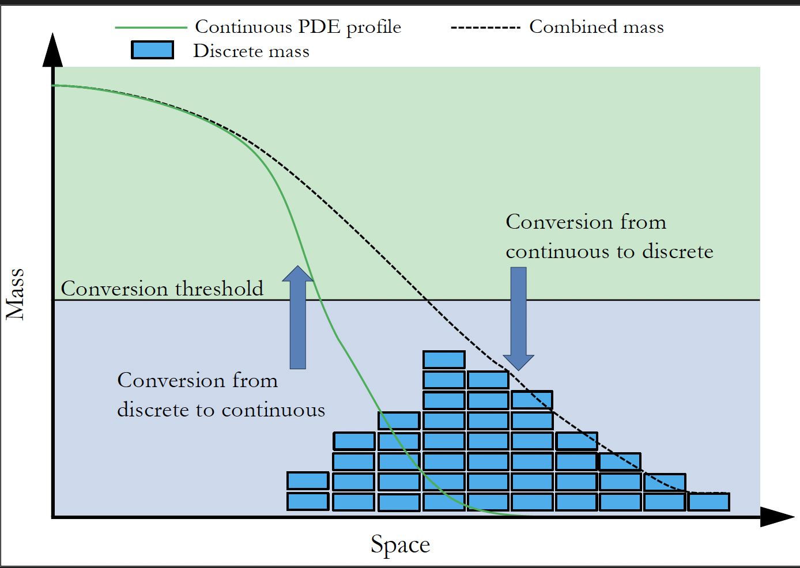

# The Spatial Regime Conversion Method (SRCM)

A Python package for simulating spatial reaction–diffusion systems using the Spatial Regime Conversion Method (SRCM).

Author: Charlie Cameron

---



## Overview

This framework provides a unified approach to modelling systems that exhibit both stochastic and deterministic behaviour. It combines:

* Stochastic simulation (SSA / RDME) for low-density regions
* Deterministic PDE models for high-density regions

within a single adaptive hybrid system that dynamically switches between representations.

---

## Methodology

This implementation is based on:

> Cameron, C. G., Smith, C. A., & Yates, C. A. (2025).
> *The Spatial Regime Conversion Method.* Mathematics, 13(21), 3406.
> [https://doi.org/10.3390/math13213406](https://doi.org/10.3390/math13213406)


### The Spatial Regime Conversion Method (SRCM)

The Spatial Regime Conversion Method (SRCM) is a hybrid modelling framework for simulating reaction–diffusion systems that combines stochastic and deterministic descriptions within the same spatial domain.

In many systems, behaviour varies spatially:

* At low particle numbers, stochastic effects dominate and are best described using SSA
* At high particle numbers, fluctuations are negligible and can be efficiently described using PDEs

SRCM addresses this by dynamically switching between representations in space and time.

### Core Idea

Each region of the domain may exist in one of two regimes:

* Discrete (stochastic): simulated using a reaction–diffusion master equation (SSA)
* Continuous (deterministic): simulated using partial differential equations (PDEs)

Mass is converted between these regimes based on local density thresholds:

* Below a threshold: convert to discrete representation
* Above a threshold: convert to continuous representation

### Key Properties

* No fixed spatial interface between regimes
* Both representations can coexist within the same region
* Conversion is governed by local threshold rules

### Implementation Details

This package implements SRCM using:

* A coarse SSA compartment grid
* A fine PDE grid
* Threshold-based conversion rules between regimes

---

## Installation

```bash
pip install "git+https://github.com/Cgyc20/Integrated-srcm-ssa.git@v1.3.0"
```

---

## Usage

### Define a System

```python
import numpy as np
from srcm import Simulation

sim = Simulation(species=["A", "B"])

sim.define_rates(alpha=0.01, beta=0.01)
sim.define_diffusion(A=0.1, B=0.1)

sim.add_reaction({"A": 1}, {"B": 1}, "alpha")
sim.add_reaction({"B": 1}, {"A": 1}, "beta")
```

### Define PDE Dynamics

```python
sim.set_pde_reactions(lambda A, B, r: (
    r["beta"] * B - r["alpha"] * A,
    r["alpha"] * A - r["beta"] * B,
))
```

### Define Conversion Rules

```python
sim.define_conversion(
    DC_threshold=10,
    CD_threshold=6,
    rate=2.0,
)
```

* DC_threshold: discrete to continuous conversion
* CD_threshold: continuous to discrete conversion

### Run Simulation

```python
results, meta = sim.run(
    L=20.0,
    K=40,
    total_time=30.0,
    dt=0.01,
    init_counts={"A": A_init, "B": B_init},
    repeats=100,
    mode="mean",
)
```

Supported modes:

* single
* mean
* trajectories
* final

### Save Results

```python
from srcm.results import save_npz

save_npz(results, "results.npz", meta=meta)
```

---

## Command Line Interface

Inspect simulation output:

```bash
srcm-inspect results.npz
```

---

## Limitations

* One-dimensional spatial domains only
* Reactions limited to order ≤ 2
* Explicit PDE time stepping

---

## Summary

This package provides:

* Pure SSA simulation
* Hybrid SSA–PDE simulation (SRCM)
* Standalone PDE modelling
* Ensemble simulation tools

for efficient and accurate simulation of spatial stochastic systems.
